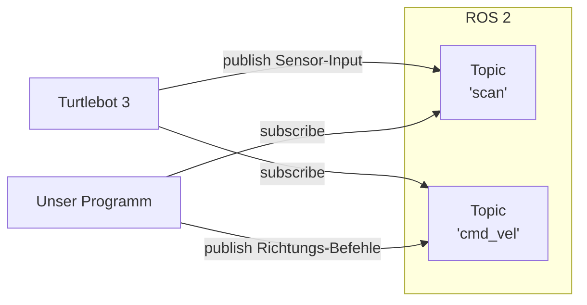

# Unser Versuch

## Problemstellung
Die Problemstellung für unseren Versuch ist relativ simpel: Einen Roboter nur anhand eines
Laser-Abstandssensors (mit 360°-Sicht) darauf zu trainieren, nicht gegen Wände zu fahren.
Der Roboter hat dabei nur Einfluss auf die Richtung, in die er sich bewegt (links/rechts/geradeaus),
nicht aber auf die Geschwindigkeit. Es gibt kein Ziel, das erreicht werden soll, sondern der Roboter (Robug)
soll einfach möglichst lange durch die Gegend fahren, ohne mit irgendetwas zu kollidieren. Zum Erreichen
dieses Ziels soll der Roboter ein neuronales Netzwerk nutzen, welches darauf trainiert wird, dieses Verhalten
zu zeigen.

## Umsetzung
Als Roboter für diesen Versuch fiel unsere Wahl auf den [Turtlebot 3](https://www.turtlebot.com/), hergestellt 
von der Firma ROBOTIS. Dieser ist nämlich speziell für Lernzwecke gedacht, bereits mit grundlegender Software
ausgestattet und kann dank Unterstützung für ROS sowohl real als auch in einer Simulation betrieben werden. Zudem
ist für dieses Modell eine [recht umfassende Dokumentation](http://emanual.robotis.com/docs/en/platform/turtlebot3/overview/#overview) online einsehbar.

Für die Kommunikation zwischen unserem Python-Programm und dem Turtlebot nutzen wir natürlich ROS 2 und seine
Python-Bibliothek `rclpy`. Die Bewegung und die Messungen des Laser-Sensors werden dabei ganz einfach über zwei
[Topics](ros/graph_concepts.md#topics) kommuniziert:

Beim neuronalen Netzwerk nutzen wir die "klassische" Form des [bestärkenden Lernens](neural_networks/reinforcement_learning.md), 
da diese vergleichsweise noch
nicht so anspruchsvoll ist wie beispielsweise das Deep Q Learning, aber trotzdem deutlich besser für das Problem
geeignet ist als ein neuronales Netzwerk zur Klassifizierung wäre. Für die Umsetzung nutzen wir dabei [Tensorflow](https://www.tensorflow.org/)
und dessen Erweiterung [Tensorflow Agents](https://github.com/tensorflow/agents/), da diese wiederverwendbare 
Implementationen für Netzwerke und Agenten anbieten.

Für das Training nutzen wir die Simulations-Software [Gazebo](http://gazebosim.org/), da diese die direkt von Turtlebot 3 unterstützte
Simulation ist. Gazebo ist mit ROS 2 kompatibel, wodurch die Unterschiede im Code zwischen Simulation und
realer Anwendung minimal sind. Die Umgebung für das Training ist eine "Welt", die als Teil der Turtlebot 3
Software mitgeliefert wird.

Um den Fortschritt des Netzwerks in Graphen festzuhalten nutzen wir die mit Tensorflow integrierte Software
[TensorBoard](https://www.tensorflow.org/tensorboard/).

Der Versuch lief über insgesamt 10 Durchläufe, bei denen jedes Mal ein Netzwerk von Anfang an trainiert wurde.
Das Training lief dabei in der Regel über ~800-1500 Iterationen mit 5 Episoden pro Iteration. Für jeden Durchlauf
wurden die Hyperparameter angepasst, um bessere Ergebnisse zu erzielen. Die Durchläufe dauerten dabei je 8-21 Stunden.

## Ergebnisse
Bei den ersten Durchläufen setzten wir noch ein relativ kleines Netzwerk von 100x50 Neuronen ein. Auch fehlte noch
ein Abnehmen der Belohnungen über längere Zeiträume, und die Belohnung war lediglich festgelegt als 1 Punkt, wenn
der Roboter nach einer Entscheidung noch "lebt", und kein Punkt, wenn er gegen eine Wand gefahren ist.

Diese Konfiguration führte allerdings nicht zum gewünschten Ergebnis, da das Netzwerk jetzt lediglich die Zeit
maximierte, die es in eine Richtung fuhr, ohne mit etwas zu kollidieren. Das war durch die Umgebung bedingt einfach
geradeaus. Robug probierte also vielleicht, mal rechts oder links zu fahren, merkte aber, dass geradeaus die längste
freie Strecke war. Diese nutzte er dann fortan aus, ohne weitere mögliche Pfade und Taktiken zu erforschen, denn für
mehr taugte die simple Struktur offenbar nicht.

Hier einmal beispielhaft der Verlauf der Verlustfunktion beim dritten Durchlauf:

Man sieht schnell, dass Robug sich hier früh eine Taktik ausgesucht hat, und die im Folgenden stumpf nurnoch
ausgenutzt hat. Die Taktik (geradeaus zu fahren) war aber leider nicht die, die wir erreichen wollten.

Um das Verhalten von Robug zu verbessern haben wir im Lauf der Durchläufe folgende Veränderungen vorgenommen:
- [Normalisierung der Belohnungen](neural_networks/reinforcement_learning.md#belohnungen-werden-normalisiert)
- [Reduktion der Lernrate von 0.001 auf 0.0001](neural_networks/optimizer.md#gradient-descent-das-gradientenverfahren)
- Vergrößerung des Netzwerks auf 360x200x100x50x15
    - Erlaubt komplexere Taktiken und gibt die Möglichkeit, alle 360 Abstände einzeln zu verarbeiten
- [Nutzen des RMSProp Optimierungsalgorithmus](neural_networks/optimizer.md#rmsprop)
- Erhöhung der Geschwindigkeit beim Lenken nach Links und Rechts
    - Erlaubt schnelleres Lenken, daher müssen Entscheidungen zum Ausweichen weniger vorausschauend getroffen werden
- Kollisionen werden mit -100 Punkten bewertet
    - Bewirkt aktive Vermeidung von Hindernissen, statt einfach nur die Zeit des Fahrens zu maximieren
- [Einführung einer Belohnungsabnahme von 0.999](neural_networks/reinforcement_learning.md#belohnungen-verlieren-ihren-wert)
    - Hilft in Kombination mit negativer Bewertung dabei, vorrausschauender auszuweichen
    
Durch diese Verbesserungen ist Robug deutlich schlauer geworden! Eine auf Dauer funktionierende Taktik hat er leider
noch nicht entwickelt, aber er schafft es so schon, am Ende des mittleren Pfades links abzudrehen und eine halbe Runde
zu fahren. Selten kriegt er es sogar hin, eine ganze Runde zu drehen!

Man sieht an den normalisierten Belohnungen, dass er mit der Zeit immer besser darin wird, hohe Belohnungen
zu erhalten:

Er ist sich aber auch deutlich unsicherer bei seiner Taktik, was man am Verlauf der Verluste erkennt:

Was natürlich noch eine wichtige Frage ist: Was genau hat Robug denn in diesem Versuch gelernt? Das Ziel ist natürlich,
dass er sich nur anhand seiner aktuellen Umgebung orientiert und Hindernissen ausweicht. Aber gerade bei großen
neuronalen Netzen besteht immer eine gewisse Gefahr, dass diese keine richtige Taktik entwickeln, sondern die Lösung
für das Problem einfach auswendig lernen, und sie sich somit nicht auf andere, ähnliche Probleme übertragen lassen.

Diese Frage ist schwierig zu beantworten, ohne sich haargenau alle Werte im Netzwerk anzusehen. Aber der Umstand, dass
Robug es manchmal schafft, eine ganze Runde zu drehen, wenn er über die "normale" Strecke hinaus kommt, spricht eher
dafür, dass er eine tatsächliche Taktik hat. Dagegen spricht, dass sich seine Route über mehrere Durchläufe stark
ähnelt. Letztendlich ist auch eine Kombination aus beidem nicht ausgeschlossen.

Wie sich Robug mit seiner Taktik in einem echten Szenario schlagen würde, konnten wir leider mangels einer
physischen Version des Turtlebot 3 nicht testen.

## Ausblick
Es stellt sich heraus, dass es echt schwer ist, nicht gegen Wände zu fahren - selbst mit einem neuronalen Netzwerk.
Was Robug sich selbst beibringen kann ist immer limitiert durch die Wahl der Hyperparameter und allgemeinen
Netzwerkarchitektur. Einige Vorgehensweisen, die Robugs Fähigkeiten von hier aus noch verbessern könnten, sind:

- Weitere Anpassung und Optimierung der Hyperparameter und Belohnungen
- Reduzierung der Entscheidungen, die pro Sekunde getroffen werden, damit eine Entscheidung nicht erst später 
"Feedback" bekommt, weil der Sensor nicht schnell genug neue Daten liefert
- Dropout
- Trainieren von Robug in mehreren unterschiedlichen Umgebungen mit zufälligen Startpositionen
- Verwendung eines [Deep Q Network, Soft Actor Critic](neural_networks/reinforcement_learning.md#soft-actor-critic) 
oder allgemein fortgeschritteneren Algorithmen
