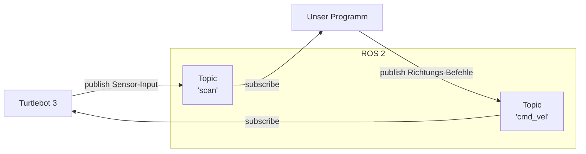

# Einleitung
## Was?
**ROS** steht für **R**obot **O**perating **S**ystem. ROS kann die Kommunikation zwischen verschiedenen Software-Komponenten eines Roboters regeln.

Durch die Art von ROS Aufbau lassen sich verschiedene Komponenten völlig unabhängig voneinander entwickeln. So gibt es beispielsweise Programme für ROS, die einen Roboter auf dem kürzesten Weg von A nach B fahren lassen können. Andere Programme/Komponenten können sich dann dieser Funktionalität bedienen und müssen sie nicht mehr selbst implementieren.

## Warum?
Der Turtlebot ist bereits darauf ausgerichtet, mit ROS betrieben zu werden. Dadurch müssen wir uns nicht mehr um low-level Kommunikation mit der Roboter-Hardware kümmern, sondern können einfach Befehle über ROS senden, zum Beispiel in welche Richtung sich der Roboter bewegen soll. Durch solche Vereinfachungen lohnt es sich, ROS zu benutzen.

## Wie?
Darum, wie ROS grundsätzlich funktioniert (und später auch, wie genau wir es benutzen), wird es sich in diesem Abschnitt drehen.

